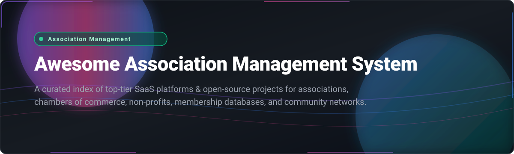

# 🏛️ Awesome Association Management System (AMS)

  
  
  
  
  
  
  

> **Curated List of SaaS Platforms & Open-Source GitHub Projects for Association Management Systems (AMS), Membership Management Software, Nonprofit CRMs, and Club Operations.**  
> *Last updated: March 2026*

---

## 📌 Overview & SEO Keywords

An **Association Management System (AMS)** is a specialized software ecosystem engineered for non-profit organizations, professional societies, trade associations, chambers of commerce, and membership clubs. These platforms centralize **membership databases**, **dues collection & automatic renewals**, **event registration & ticketing**, **member portals**, **email communications**, and **financial reporting**.

Whether you are seeking enterprise cloud SaaS (like *Nimble AMS*, *Higher Logic*, *iMIS*, or *Fonteva*) or self-hosted open-source software (like *CiviCRM*, *ChurchCRM*, *Tendenci*, or *Admidio*), this index provides a comprehensive comparison of features, pricing, free tier limits, company scale, and open-source GitHub community traction.

---

## 📑 Table of Contents

- [☁️ SaaS & Hosted Platforms](#️-saas--hosted-platforms)
- [💻 Open-Source GitHub Projects](#-open-source-github-projects)
- [🤝 How to Contribute](#-how-to-contribute)
- [📈 Star History](#-star-history)
- [💖 Support & Sponsorship](#-support--sponsorship)
- [⚠️ Disclaimer](#️-disclaimer)

---

## ☁️ SaaS & Hosted Platforms

**Market Overview**: The global Association Management Software (AMS) sector is estimated at **$2.66B – $2.97B (2026)** and projected to reach **$4.35B – $4.64B by 2030–2031** (10–12% CAGR). The market structure is **moderately fragmented**—undergoing consolidation via private equity platform aggregators (such as Momentive Software, Togetherwork, and Personify), while specialized niche vendors continue to serve specific tiers and verticals.

| Product | Description | Company Size / Revenue / Valuation | Starting Price | Free Tier / Trial Limit |
| :--- | :--- | :--- | :--- | :--- |
| **[Nimble AMS](https://www.nimbleams.com/)** | Association management system built natively on Salesforce, offering AI, predictive analytics, and automation. | ~$145.2M ARR (Parent: Momentive Software / Community Brands, 2,000+ employees) | $160 / user / month | Interactive product demo available; no self-service free trial |
| **[YourMembership](https://www.yourmembership.com/)** | All-in-one AMS with member portal, online community, event management, and e-commerce capabilities. | ~$145.2M ARR (Parent: Momentive Software / Community Brands, 2,000+ employees) | $3,990 / year ($332.50 / month) | Guided platform demo available; no self-service free trial |
| **[MemberClicks](https://memberclicks.com/)** | Membership management platform for associations and chambers with MC Professional and MC Trade tiers. | ~$145.2M ARR (Parent: Momentive Software / Community Brands, 2,000+ employees) | $3,500 / year ($291.67 / month) | Customized demo session available; no self-service free trial |
| **[Higher Logic Thrive](https://www.higherlogic.com/)** | All-in-one community and marketing platform for associations with AI-powered member support. | ~$68.3M ARR (~340 employees) | $5,000 / year ($416.67 / month) | Guided product demo available; no self-service free trial |
| **[iMIS](https://www.imis.com/)** | Cloud constituent engagement and AMS platform offering billing, events, and website tools. | ~$50M–$75M ARR (Developer: ASI / Incline Equity Partners, ~403 employees) | $200 / user / month | Guided platform demo available; no self-service free trial |
| **[Fonteva](https://www.fonteva.com/)** | Events and membership management solution built 100% natively on Salesforce. | ~$42.7M ARR (Parent: Togetherwork / GI Partners, ~258 employees) | $175 / user / month | Personalized demo available; no self-service free trial |
| **[Personify360](https://www.personifycorp.com/)** | Enterprise-level AMS with deep integration capabilities and complex operational management. | ~$36.7M ARR (Parent: Personify Corp / Pamlico Capital, ~200+ employees) | $10,000 / year ($833.33 / month) enterprise base | Strategic sales consultation & demo; no self-service free trial |
| **[WildApricot](https://www.wildapricot.com/)** | All-in-one membership software for small associations, nonprofits, and clubs with website builder. | ~$36.7M ARR (Parent: Personify Corp; standalone ~$15M ARR) | $66 / month ($59.40 / month billed annually) for up to 100 contacts | 60-day free trial (up to 50 contacts, no credit card required) |
| **[GrowthZone](https://www.growthzone.com/)** | AMS ecosystem covering member management, events, billing, marketing automation, and portals. | ~$24.9M ARR (~198 employees, Greenridge Investment Partners) | $4,000 / year ($333.33 / month) | Scheduled product demo available; no self-service free trial |
| **[Glue Up](https://www.glueup.com/)** | Engagement management platform with events, membership, CPD credits tracking, and community tools. | ~$14.1M ARR (~128 employees) | $125 / month ($1,500 / year base package) | 14-day free trial (feature-limited sandbox, demo available) |
| **[MemberSuite](https://www.membersuite.com/)** | Cloud-based AMS designed for associations with complex membership structures and organizations. | ~$10M ARR (~60 employees) | $5,000 / year ($416.67 / month) | Scheduled demo session available; no self-service free trial |

---

## 💻 Open-Source GitHub Projects

Below are active open-source Association Management Systems and membership management platforms for self-hosting, custom developer extensions, and transparent non-profit data control.

*Sorted by GitHub Stars_Count (Descending)*

- **[ChurchCRM](https://github.com/ChurchCRM/CRM)**   
  Free, open-source church and community management software for managing constituent profiles, families, groups, events, attendance, giving, and volunteers. Built with PHP & MySQL.

- **[CiviCRM](https://github.com/civicrm/civicrm-core)**   
  The leading open-source CRM for nonprofits and associations. Offers comprehensive constituent management, donations, events, memberships, and email campaigns. Integrates natively with WordPress, Drupal, Joomla, and Backdrop.

- **[Tendenci](https://github.com/tendenci/tendenci)**   
  Open-source association management system and CMS built specifically for nonprofits and associations using Python/Django. Features membership management, event registration, donations, forums, and photo galleries.

- **[Hitobito](https://github.com/hitobito/hitobito)**   
  Open-source web application for managing complex group hierarchies with members, events, courses, and mailings. Features a modular plugin architecture via Wagons. Used widely by European youth organizations and associations.

- **[Admidio](https://github.com/Admidio/admidio)**   
  Free open-source user and organization management system for websites of groups, clubs, and societies. Includes flexible role-based access permissions, event calendars, photo albums, and document management.

- **[MemberPrism2](https://github.com/easychen/MemberPrism2)**   
  Open-source alternative to Memberstack and MemberSpace with both front-end and back-end member-only content protection and subscription tracking.

- **[Byro](https://github.com/byro/byro)**   
  Plugin-based, unopinionated membership administration software for small and medium clubs, NGOs, and associations. Built with Django, featuring Mailman integration and automated receipt generation.

- **[Galette](https://github.com/galette/galette)**   
  Membership management web application for non-profit organizations and associations released under GPLv3. Actively maintained since 2013, with strong multi-language support.

- **[Makerspace Membership System](https://github.com/southlondonmakerspace/membership-system)**   
  Database and API for managing member records, subscription payments, access control permissions, event logging, and Discourse SSO integration.

- **[OpenRepairPlatform](https://github.com/AtelierSoude/OpenRepairPlatform)**   
  Django-based web application for managing non-profit collaborative structures, member registrations, repair workshops, and event logistics.

- **[Cantiga](https://github.com/zyxist/cantiga)**   
  PHP/Symfony membership management system designed to assist non-profit organizations in administering projects, members, and regional structures.

- **[Narvik](https://github.com/Narvik-app/frontend)**   
  SaaS-style association management solution released under AGPLv3. Includes member administration, season passes, POS module, email templates, and role-based permissions.

- **[CJ-7](https://github.com/NEJANX/CJ-7)**   
  Lightweight web-based member management system for school clubs and societies, written in PHP.

- **[Open-Club-Manager](https://github.com/Code-Institute-Submissions/Open-Club-Manager)**   
  Django club management platform featuring user authentication, facility booking management, custom theming, and Stripe payment integration.

- **[AMS (DTTA)](https://github.com/digital-technologies-teachers-aotearoa/ams)**   
  Modern Django + Wagtail association management platform featuring individual/organization memberships, Xero accounting sync, and Discourse forum SSO.

---

## 🤝 How to Contribute

Contributions from developers and association managers are welcome!

1. Fork the repository.
2. Add or update entries in `README.md` following the established table / list schema.
3. Ensure links are active and descriptions remain factual and objective.
4. Submit a Pull Request with a clear summary of changes.

Check out [Awesome List Guidelines](https://github.com/ishandutta2007/Awesome-Awesome-Awesome) for standard practices.

---

## 📈 Star History

---

## 💖 Support & Sponsorship

Thank you for exploring **Awesome Association Management System**! 🌟

If this project helps you discover software solutions for your association, nonprofit, or club:
- ⭐ **Star** this repository to increase visibility.
- 🔀 **Fork** it to maintain your custom shortlist.
- 📢 **Share** it with colleagues and community managers.

### ☕ Sponsor & Buy a Coffee
If you would like to support ongoing updates and maintenance of this list, consider sponsoring:

---

## ⚠️ Disclaimer

- This is a **community-curated index** for informational purposes.
- Association software deployment must adhere to organizational compliance, data privacy laws (e.g., GDPR, CCPA), and non-profit accounting standards.
- Self-hosted solutions require proper routine backups, server administration, and security maintenance.

---

**Made with ❤️ for associations, chambers of commerce, nonprofits, clubs, and membership leaders.**
